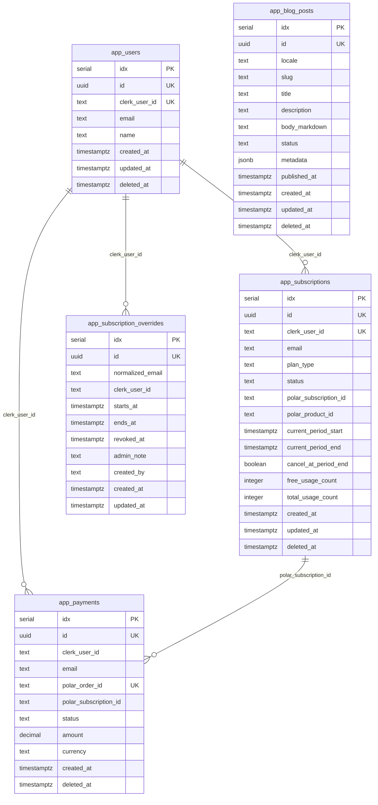

# ERD: 데이터 모델과 관계 문서

## 1. 목적

ERD(Entity Relationship Diagram)는 데이터베이스의 테이블, 주요 컬럼, 관계, 카디널리티를 구현 전에 정리하는 문서입니다. 실제 DB 스키마는 Drizzle schema와 migration에 작성하지만, 구현 전에 이 문서에서 데이터 모델의 의도를 먼저 확정합니다.

## 2. 작성 기준

- 테이블명은 브랜드가 없는 범용 이름을 사용합니다.
- 모든 테이블은 내부 PK인 `idx SERIAL PRIMARY KEY`와 외부 노출용 UUID `id`를 분리합니다.
- 생성/수정 시각은 `timestamptz` 기준으로 관리합니다.
- 삭제가 필요한 운영 데이터는 soft delete 정책을 먼저 검토합니다.
- 개인정보, 결제 데이터, webhook 원문 보존 범위는 PRD/TRD의 보안 요구사항과 함께 결정합니다.
- 다국어 콘텐츠는 locale 컬럼, slug uniqueness, canonical 정책을 함께 정의합니다.

## 3. Mermaid ERD 초안

## 4. 테이블 정의

| Table | 목적 | 주요 관계 | 보존/삭제 정책 |
| --- | --- | --- | --- |
| `app_users` | Clerk 사용자와 앱 내부 사용자를 연결합니다. | `clerk_user_id`로 구독, 결제, 수동 부여와 논리 연결 | 계정 삭제 정책에 따라 soft delete 또는 익명화 |
| `app_subscriptions` | Polar 구독 상태와 사용량을 앱 내부 상태로 동기화합니다. | `clerk_user_id`, `polar_subscription_id`로 연결 | 결제 감사 목적에 따라 보존 기간 결정 |
| `app_payments` | 주문과 결제 이력을 기록합니다. | `clerk_user_id`, `polar_subscription_id`로 연결 | 법무/회계 기준에 따라 보존 |
| `app_subscription_overrides` | 어드민이 수동으로 구독 권한을 부여/회수한 이력을 기록합니다. | `normalized_email`, `clerk_user_id`로 연결 | 감사 로그 성격으로 보존 기간 결정 |
| `app_blog_posts` | locale별 블로그 콘텐츠를 관리합니다. | 독립 테이블 | 비공개 처리 또는 soft delete |

## 5. 인덱스와 제약조건

| 대상 | 제약/인덱스 | 이유 |
| --- | --- | --- |
| `app_users.clerk_user_id` | Unique | Clerk webhook 중복 처리 방지 |
| `app_users.id` | Unique | 외부 URL/API 노출용 식별자 |
| `app_subscriptions.clerk_user_id` | Unique | 사용자별 활성 구독 상태 단일화 |
| `app_payments.polar_order_id` | Unique | Polar order 중복 기록 방지 |
| `app_subscription_overrides.normalized_email` | Index | 이메일 기준 수동 부여 조회 |
| `app_blog_posts(locale, slug)` | Unique | locale별 slug 충돌 방지 |

## 6. 확정 전 체크리스트

- [ ] PRD의 사용자/결제/콘텐츠 요구사항과 테이블이 연결됩니다.
- [ ] Use Case의 주요 흐름을 ERD 관계로 설명할 수 있습니다.
- [ ] IA의 페이지와 필요한 데이터가 연결됩니다.
- [ ] TRD의 API와 DB 요구사항이 ERD의 테이블/관계와 일치합니다.
- [ ] Drizzle schema와 migration에 반영할 PK, FK, index, unique 제약이 정리되었습니다.
- [ ] 개인정보, 결제정보, webhook payload의 보존/삭제 정책이 정해졌습니다.
